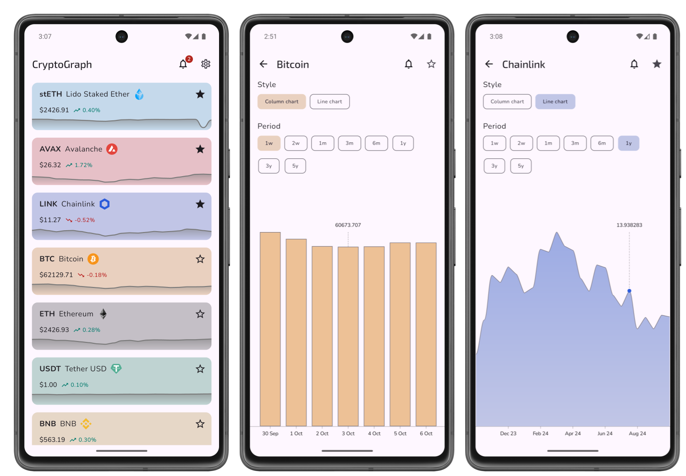
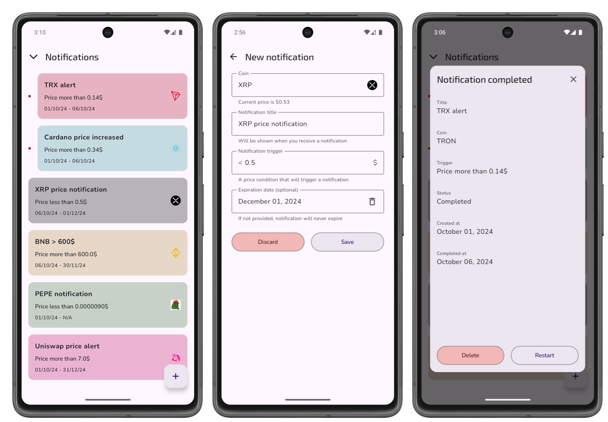

## Coin price charts

View price history charts of your favourite coins



## Price change notifications

Create notifications to get updated on the latest price changes



## Build instructions

1. Get [Coinranking API key](https://account.coinranking.com/create-developer-account)

2. Create `secret.properties` file in the project root
   ````
    COINRANKING_API_KEY="[YOUR_API_KEY]"
   ````

3. [Create Firebase project](https://firebase.google.com/docs/android/setup) for Analytics, Crashlytics and Remote Config support

4. Copy `google-services.json` file to the `app` folder

5. [Generate key and keystore](https://developer.android.com/studio/publish/app-signing#generate-key) for release builds

6. Create `keystore.properties` file in the project root
   ````   
   storeFile=[YOUR_KEYSTORE_FILE_PATH]
   storePassword=[YOUR_KEYSTORE_PASSWORD]
   keyAlias=[YOUR_KEY_ALIAS]
   keyPassword=[YOUR_KEY_PASSWORD]
   ````